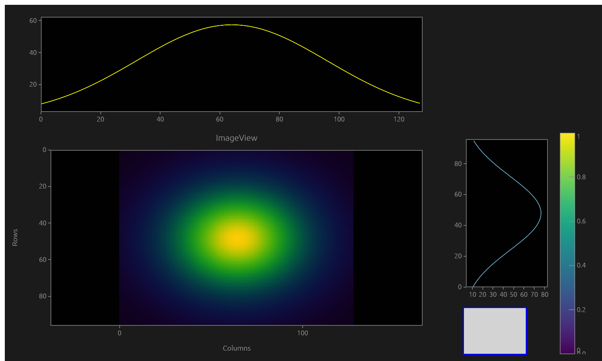
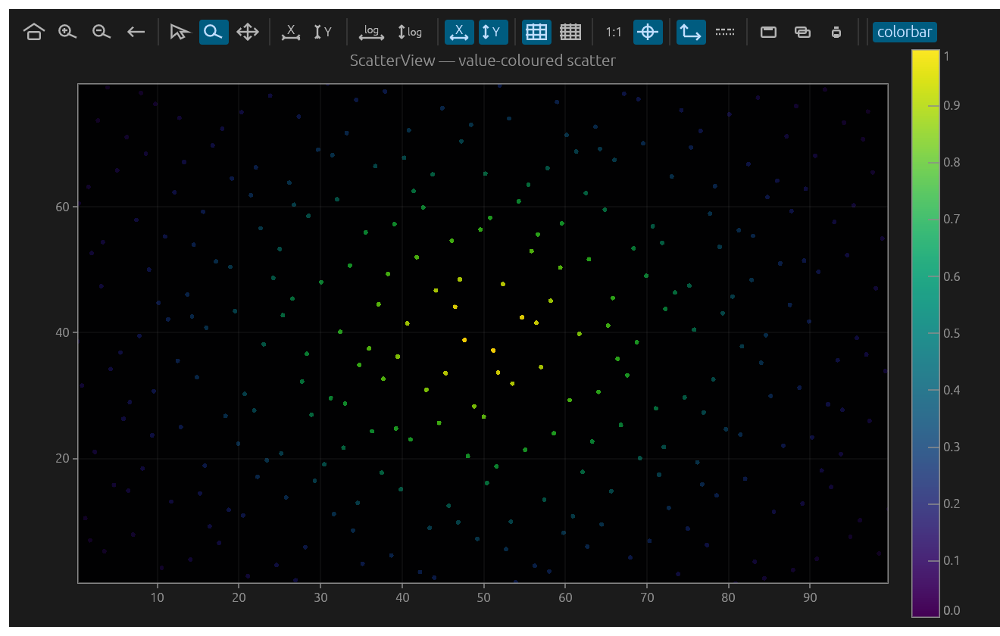
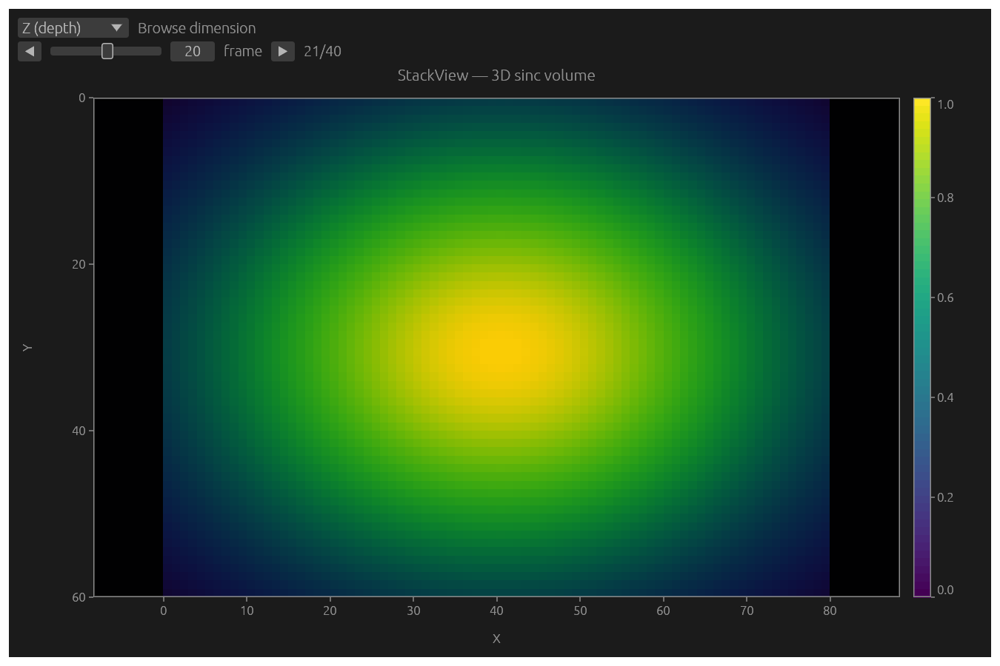
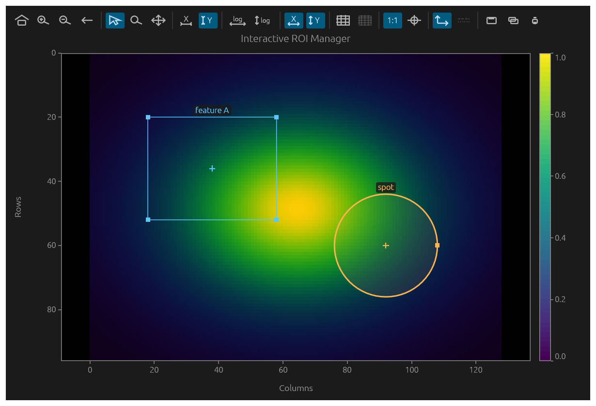

# siplot

**silx-style scientific plotting for [egui](https://github.com/emilk/egui), rendered with [wgpu](https://github.com/gfx-rs/wgpu).**

`siplot` is a Rust port of [silx](https://www.silx.org/)'s `silx.gui.plot`
scientific plotting toolkit, rebuilt as an immediate-mode egui widget with a
wgpu data layer. It pairs GPU-rendered data items (colormapped images,
polyline curves, scatter clouds, triangle meshes) with egui-drawn chrome
(frame, grid, ticks, labels, colorbar, legend) under one shared coordinate
transform.

> **Status:** early release (`0.1.0`). The API still moves between releases.
> Parity with `silx.gui.plot` is tracked in
> [`doc/parity-roadmap.md`](doc/parity-roadmap.md).

License: MIT OR Apache-2.0.

---

## Gallery

A few of the high-level widgets, captured headlessly from the matching
`high_level_*` examples. Each image is rendered to an offscreen wgpu texture
by [`examples/gallery.rs`](examples/gallery.rs) — full egui chrome plus the
`egui_wgpu` data layer, no window — so the gallery can be regenerated with
`cargo run --example gallery`.

| | |
| :---: | :---: |
|  |  |
| **PlotWidget** — colormapped image with a curve overlay, legend, and active-item stats | **Plot2D** — an image with a threshold mask overlay |
|  |  |
| **ImageView** — a central image with column/row side-profile histograms | **ScatterView** — value-coloured scatter with a colorbar |
|  |  |
| **StackView** — a 3D volume browsed as 2D frames, with perspective selection | **CompareImages** — half-split A vs B comparison |
|  |  |
| **FitWidget** — an iterative Gaussian curve fit with parameter errors | **ROI manager** — styled, named ROIs rendered on the plot |

---

## Highlights

- **Curves** — line styles, point symbols, fill/baseline bands, error bars
  (symmetric / asymmetric / per-point), a secondary (right) Y axis, log axes,
  and min/max decimation for large series.
- **Images** — colormapped scalar images and direct RGBA, with origin/scale
  placement, per-pixel alpha, GPU tiling for very large images, and 8 built-in
  colormaps under linear / log / sqrt / gamma normalization, plus a colorbar.
- **Markers & shapes** — point/vline/hline markers (draggable, with text
  anchors and constraints) and polygon / rectangle / polyline / hline / vline
  shapes with fill and dashed outlines.
- **Regions of interest** — create and edit ROIs directly on the plot, a ROI
  manager with per-instance color / name / selection / line style / fill, and
  ROI statistics (image pixel stats and per-curve raw/net counts & area).
- **Interaction** — pan, box-zoom, zoom history, select, crosshair cursor,
  point picking, and an X/Y position-info readout bar.
- **Tools & dialogs** — colormap dialog, image and scatter mask tools, an
  iterative curve-fit widget (Gaussian / Lorentzian / Pseudo-Voigt / linear),
  statistics widget, limits editor, item-selection dialog, profile tools, and
  pixel-intensity histograms.
- **Composite views** — `ImageView` (side histograms + radar overview),
  `ScatterView` (value-coloured points, selection mask, X/Y/Data/Index
  readout), `StackView` (3D volume browsing with perspective selection,
  transposition, and per-dimension axis labels), `CompareImages`
  (A / B / split / subtract), `ComplexImageView`, and `ImageStack`.
- **Export** — save the figure to PNG / PPM / SVG / TIFF (with a native save
  dialog), copy to the clipboard, or send to the system printer.
- **Multi-plot** — link axes across panels with `SyncAxes`.

## Architecture

The crate mirrors silx's `BackendBase ↔ BackendPygfx` split across three layers:

| Module    | Responsibility |
| --------- | -------------- |
| `core`    | The `Plot` model, the `Backend` trait, and shared types (`Transform`, `Colormap`, `Roi`, `Marker`, …). |
| `render`  | The wgpu renderer — an `egui_wgpu::CallbackTrait` implementation that owns the GPU resources. |
| `widget`  | High-level retained widgets plus `PlotView` for chrome, interaction, and paint-callback registration. |

There are two API layers:

- **`PlotView`** — stateless chrome and interaction wrapped around a `Plot`
  model; you drive GPU item uploads directly.
- **`PlotWidget` / `PlotWindow` / `Plot1D` / `Plot2D`** and the composite views
  — retained widgets that own a `WgpuBackend`, item handles, labels, limits,
  legend metadata, item statistics, events, and toolbar helpers.

## Requirements

- A recent Rust toolchain (edition 2024; `rust-version = 1.92`).
- An egui application running on the **wgpu** renderer — `siplot` renders
  through an `egui_wgpu` paint callback and needs the wgpu `RenderState`.
- egui / egui-wgpu **0.34**. `siplot` re-exports `egui` and `egui_wgpu`
  (`siplot::egui`, `siplot::egui_wgpu`) so downstreams can stay on the same
  versions without skew.

## Quick start

With [`eframe`](https://github.com/emilk/egui/tree/master/crates/eframe) on the
wgpu renderer:

```rust
use eframe::egui;
use siplot::{Plot1D, PlotWidget};

struct DemoApp {
    plot: Plot1D,
}

impl DemoApp {
    fn new(cc: &eframe::CreationContext<'_>) -> Self {
        // The wgpu render state is only present on the wgpu renderer.
        let rs = cc
            .wgpu_render_state
            .as_ref()
            .expect("eframe must use the wgpu renderer (NativeOptions.renderer = Wgpu)");

        let mut plot = Plot1D::new(rs, 0);
        plot.set_graph_title("siplot demo");

        let x: Vec<f64> = (0..400).map(|i| i as f64 * 0.025).collect();
        let y: Vec<f64> = x.iter().map(|v| v.sin()).collect();
        plot.add_curve_with_legend(&x, &y, egui::Color32::LIGHT_BLUE, "sin");

        Self { plot }
    }
}

impl eframe::App for DemoApp {
    fn ui(&mut self, ui: &mut egui::Ui, _frame: &mut eframe::Frame) {
        egui::CentralPanel::default().show_inside(ui, |ui| {
            self.plot.show_toolbar(ui);
            self.plot.show(ui);
        });
    }
}

fn main() -> eframe::Result {
    eframe::run_native(
        "siplot demo",
        eframe::NativeOptions {
            renderer: eframe::Renderer::Wgpu,
            ..Default::default()
        },
        Box::new(|cc| Ok(Box::new(DemoApp::new(cc)) as Box<dyn eframe::App>)),
    )
}
```

## Choosing a widget

| Widget | Use it for |
| ------ | ---------- |
| `PlotWidget` / `PlotWindow` | The general silx-style item API (curves, images, markers, shapes, ROIs). |
| `Plot1D` | Curve-first views (X/Y labels + major grid by default). |
| `Plot2D` | Image-first views (kept data aspect ratio, colorbar). |
| `ImageView` | A central image with column-sum / row-sum side histograms and a radar overview. |
| `ScatterView` | Value-coloured scatter with a colorbar, selection mask, and position-info panel. |
| `StackView` | A 3D volume browsed as 2D frames, with perspective selection and per-dimension labels. |
| `CompareImages` | Compare two images (A / B / half-half split / A−B subtract). |
| `ComplexImageView` | Complex-valued images (amplitude / phase / real / imaginary …). |
| `ImageStack` | A lazy frame browser over a stack of images. |

`PlotView` remains available when you want direct control over GPU item uploads
around a bare `Plot` model.

## Examples

The repository ships 60 runnable examples. Run any of them with:

```sh
cargo run --example <name>
```

The `high_level_*` examples deliberately mirror common silx examples from
`silx/examples/`. A few starting points:

| Run | Shows |
| --- | --- |
| `cargo run --example bootstrap` | A minimal empty `PlotView` in an eframe window. |
| `cargo run --example high_level_plot_widget` | Toolbar, image, scatter, histogram, legend, active-item stats. |
| `cargo run --example high_level_plot2d` | Image display, mask overlay, row/column profile extraction. |
| `cargo run --example high_level_image_view` | `ImageView` with side histograms. |
| `cargo run --example high_level_scatter_view` | `ScatterView` value-coloured scatter + X/Y/Data/Index readout. |
| `cargo run --example high_level_stack_view` | `StackView` 3D volume browsing with a perspective selector. |
| `cargo run --example high_level_compare_images` | `CompareImages` A / B / split / subtract modes. |
| `cargo run --example high_level_fit_widget` | Iterative curve fitting (Gaussian / Lorentzian / Pseudo-Voigt). |
| `cargo run --example high_level_roi_manager` | Styled, named, selectable ROIs on the plot. |
| `cargo run --example high_level_colormap_dialog` | Runtime colormap / vmin / vmax / normalization picker. |

See [`doc/high-level-api.md`](doc/high-level-api.md) for the full silx-example
mapping.

## Documentation

- [`doc/design.md`](doc/design.md) — architecture and design notes.
- [`doc/high-level-api.md`](doc/high-level-api.md) — the high-level widget API
  and its mapping to silx examples.
- [`doc/parity-roadmap.md`](doc/parity-roadmap.md) — feature-by-feature parity
  tracking against `silx.gui.plot`.

## Relationship to silx

`siplot` ports `silx.gui.plot` (and adjacent `silx.gui` features) to Rust,
following the upstream behaviour to fine UX detail. silx itself is the
reference; throughout the code and docs, bare `silx` refers to the upstream
Python project, not to this crate.

## License

Licensed under either of

- Apache License, Version 2.0
- MIT license

at your option.
